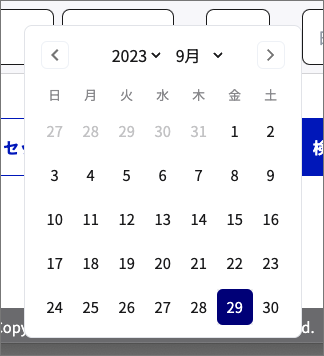
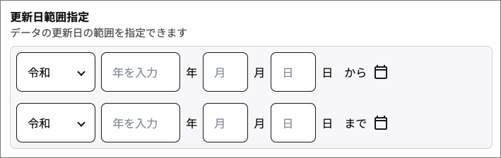
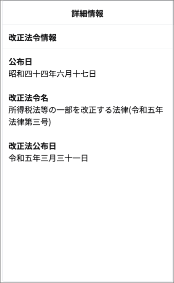
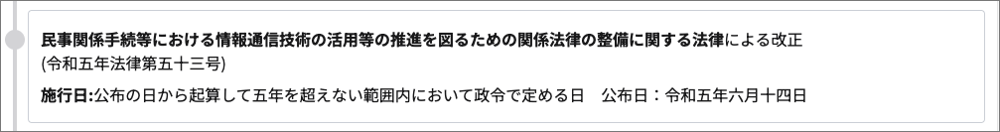

# 操作マニュアル

## 目次

- [概要](#概要)
- [動作環境](#動作環境)
- [基本画面と利用方法](#基本画面と利用方法)
   - [共通機能](#共通機能)
   - [画面1: キーワード検索画面](#画面1-キーワード検索画面)
   - [画面2: 詳細検索画面](#画面2-詳細検索画面)
   - [画面3: 法令画面](#画面3-法令画面)
   - [画面4: 沿革画面](#画面4-沿革画面)
   - [画面5: 添付ファイル表示画面](#画面5-添付ファイル表示画面)
- [関連リソース](#関連リソース)

## 概要
本マニュアルでは、法令APIプロトタイプを利用したサンプルアプリケーションの操作方法を説明します。  

## 動作環境

本サンプルはPCとモバイルに対応しています。  
以下の一覧は、動作推奨環境をまとめたものです。

### PC

PCで利用する場合、以下のOSとブラウザの利用を推奨します。

| 種類 | 対応OS/ブラウザ                      |
|------|-----------------------------------|
| OS   | Windows 10 以上                    |
|      | macOS 10.15(Catalina) 以上          |
| ブラウザ | Google Chrome (最新版)           |
|      | Microsoft Edge (最新版)            |
|      | Mozilla Firefox (最新版)           |
|      | Safari (最新版)              |

### モバイル

モバイル端末で利用する場合、以下のOSとブラウザの利用を推奨します。

| 種類 | 対応OS/ブラウザ                      |
|------|-----------------------------------|
| OS   | Android 11.0 以上                  |
|      | iOS 13.0 以上                      |
| ブラウザ | Google Chrome (最新版)           |
|      | Safari (最新版)              |

### その他

- インターネットに接続されていること
- JavaScriptが有効になっていること

### 注意事項

- 上記以外の環境では、アプリケーションが正しく機能しない場合があります

## 基本画面と利用方法

本セクションでは、サンプルの基本的な画面とその利用方法を記載します。 

### 共通機能

本サンプルは、以下の共通機能を提供しています。

#### ヘッダー

 1. **ロゴ**
    - ヘッダー左上のロゴ(法令検索)をクリックすると、アプリケーションのトップ画面(キーワードから探す画面)に遷移します

 2. **ヘルプリンク**
    - ヘルプリンクをクリックすると、以下のリンクが表示されます
       - API仕様書（Swagger UI）は、API仕様を記載したページに遷移します

### 画面1: キーワード検索画面
キーワードを指定して法令データを検索することができます。  
以下に、主な機能とその利用方法を記載します。

#### 機能:検索フォーム(キーワードから探す画面)

1. **キーワード入力フォーム**

   - 検索したい法令データのキーワードを入力します
   - 指定した単一のキーワードに該当する法令データが検索されます
   - キーワードは**必須入力項目**です

2. **時点指定フォーム**

   - 検索したい法令データの時点を指定します
   - 現行法令を指定した場合、システム日付時点で有効な法令が対象となります
   - 時点指定を指定した場合、指定した時点の法令が検索対象となります
      - **年号、年、月、日を全て入力する必要があります**
   - カレンダーアイコンをクリックすることで、カレンダーから日付を選択することができます

3. **検索ボタン**／**リセットボタン**

   - 検索ボタンをクリックすると、検索を実行します
   - リセットボタンをクリックすると、設定内容が初期化されます

#### 機能:検索結果表示エリア(キーワード検索画面)

1. **検索結果表示**
   - 検索結果はこのエリアにリスト形式で表示されます
   - 1ページに表示される検索結果の件数は**20件**です
   - 指定した時点、検索結果の総件数、現在表示中の件数、ソート、ページネーションが表示されます

2. **検索結果アイテム**
   - **法令名、法令番号、法令種別、公布日、施行日、キーワード検索の場合はキーワードに該当した本文の箇所**が表示されます
   - 改正法令情報の表示アイコン、条文沿革リンクが表示されます

3. **法令画面リンク**
   - **法令名**をクリックすると、法令データを表示する**法令画面**に遷移します

4. **改正法令情報の表示**
   - 改正法令情報の表示アイコン(インフォメーションアイコン)をクリックすると、改正法令情報が表示されます
   - 改正法令情報には、**改正法令名、改正法令番号、改正法公布日**が表示されます
   - 閉じるボタンをクリックすると、改正法令情報を閉じることができます

5. **条文沿革リンク**
   - **「条文沿革を表示」** リンクをクリックすると、法令の条文沿革を確認できる**沿革画面**に遷移します

6. **検索結果ソート**
   - 法令データの検索結果を特定の基準に基づいてソート(並び替え)できます
   - ソート順は、**種別・法令番号(降順)、種別・法令番号(昇順)、公布日(降順)、公布日(昇順)、五十音順** の５種類があります

7. **ページネーション**
   - 現在表示している検索結果とは別の検索結果を表示できます
   - ページネーションの中央には、**現在表示中のページ番号/総ページ数** という形式でページ番号が表示されます
   - ページネーションのボタンには、一番最初のページに移動、一つ前のページに移動、一つ後のページに移動、一番最後のページに移動の4つのボタンがあります

#### キーワード検索で利用しているAPI

キーワード検索API (`/keyword`)

### 画面2: 詳細検索画面

法令名や法令番号、法令種別等の情報を指定して法令データを検索することができます。  

#### 機能:検索フォーム(詳細検索画面)

1. **法令名or法令番号入力フォーム**
   - 検索したい法令データの法令名または法令番号を入力します
   - 法令名で検索する場合、法令名のラジオボタンを選択し、法令名を入力します
      - 法令名は**部分一致**検索です
   - 法令番号で検索する場合、法令番号のラジオボタンを選択し、法令番号を入力します
      - 法令番号は**完全一致**検索です

2. **法令種別**
   - 検索対象の法令種別を指定できます
   - 法令の種別には**憲法、法律、政令、勅令、府省令、規則、その他**の７種類があります
   - 全選択を選択した場合、全ての法令種別が検索対象になります
   - 全解除を選択した場合、法令種別のチェックが全て外れます
      - 検索時は、法令種別の指定がないものとして検索されます

3. **時点指定フォーム**
   - 検索したい法令データの時点を指定します
   - 現行法令を指定した場合、システム日付時点で有効な法令が対象となります
   - 時点指定を指定した場合、指定した時点の法令が検索対象となります
      - **年号、年、月、日を全て入力する必要があります**
   - カレンダーアイコンをクリックすることで、カレンダーから日付を選択することができます

4. **公布日範囲指定**
   - 検索対象となる法令データの公布日の範囲を指定できます
      - **年号、年、月、日を全て入力する必要があります**
   - \~から(from)、\~まで(to)の2つの欄を利用して、公布日の範囲を指定できます
      - どちらか一方のみの指定も可能です
   - カレンダーアイコンをクリックすることで、カレンダーから日付を選択することができます

5. **検索対象の分類**
   - 検索対象の法令データの分類を指定できます
   - 分類には、憲法、刑事、財務通則、水産業などの分類があります
   - 全選択を選択した場合、全ての分類が検索対象となります
   - 全解除を選択した場合、分類のチェックが全て外れます
      - 検索時は、分類の指定がないものとして検索されます

6. **更新日範囲指定**
   - 検索対象の法令データの更新日の範囲を指定できます
      - **年号、年、月、日を全て入力する必要があります**
   - \~から(from)、\~まで(to)の2つの欄を利用して、更新日の範囲を指定できます
      - どちらか一方のみの指定も可能です
   - カレンダーアイコンをクリックすることで、カレンダーから日付を選択することができます

7. **検索ボタン**／**リセットボタン**
   - 検索ボタンをクリックすると、検索条件の内容で検索を実行します
   - リセットボタンをクリックすると、設定内容が初期化されます。

#### 機能:検索結果表示エリア(詳細検索画面)

[検索結果表示エリア(キーワード検索画面)](#機能検索結果表示エリアキーワード検索画面)を参照してください。

#### 詳細検索画面で利用しているAPI

法令一覧取得API (`/laws`)

### 画面3: 法令画面

法令画面では、法令データを閲覧することができます。  

#### 機能(法令画面)

1. **法令タイトル表示**
   - 選択した法令の**法令名、法令番号、法令種別**が表示されます

2. **法令本文表示エリア**
   - 選択した法令の本文が表示されます
   - 法令本文内にPDFファイルのアイコンが表示されている場合、**PDFファイルをダウンロード**することができます
   - 法令本文内に画像ファイルが表示されている場合、画像をクリックすると**添付ファイル表示画面**に遷移します

3. **改正法令情報の表示**
   - 選択した法令の改正法令情報として**公布日、改正法令名、改正法公布日**が表示されます

4. **施行日の表示**
   - 選択した法令の施行日が表示されます

5. **条文沿革リンク**
   - 条文沿革リンクをクリックすると、法令の条文沿革を確認できる**沿革画面**に遷移します

6. **PDFファイルダウンロードボタン**
   - 法令内に添付ファイルとしてPDFファイルがある場合、このアイコンボタンが表示されます
   - PDFファイルダウンロードボタンをクリックすると、PDFファイルをダウンロードできます

7. **添付画像表示**
   - 法令内に添付ファイルとして画像ファイルがある場合、画像が表示されます
   - ユーザーは画像をクリックすることで、**添付ファイル表示画面** に遷移できます

#### 法令画面で利用しているAPI

法令本文取得API (`/lawdata`)、添付ファイル取得API (`/attached`)

### 画面4: 沿革画面

沿革画面では、法令の改正履歴の沿革を確認できます。

#### 機能(沿革画面)

1. **法令沿革履歴の表示**
   - 法令の改正履歴の沿革が表示されます
   - **施行日の降順**で表示されます
   - 施行日が確定していない法令も表示されます

2. **法令名表示エリア**
   - 法令の**法令名、法令番号**が表示されます

3. **沿革履歴法令リンク**
   - 選択した法令の**改正法令名、改正法令番号**、その改正法による**公布日**と**施行日**が表示されます
   - 沿革履歴法令リンクをクリックすると、その時点の法令の**法令画面**に遷移します
   - 法令画面から沿革画面に遷移した場合、その時点の沿革履歴法令リンクが"表示中"と表示されます

#### 沿革画面で利用しているAPI

法令履歴一覧取得API (`/law_revisions`)

### 画面5: 添付ファイル表示画面

添付ファイル表示画面では、法令の添付画像を確認することができます。

#### 機能(添付ファイル表示画面)

1. **添付画像表示エリア**
   - 画像のイメージが表示されます

#### 添付ファイル表示画面で利用しているAPI

添付ファイル取得API (`/attached`)

## 関連リソース

サンプルアプリケーションの開発や利活用に役立つリソースの一覧です。

- [**ソースコード**](../src/): 本サンプルのソースコードです
- [法令APIプロトタイプ公開テストを開催します｜デジタル庁](https://www.digital.go.jp/policies/legal-practice/public-test): 法令APIプロトタイプ公開テスト利用マニュアルをご覧ください

---

Copyright (c) 2023 Digital Agency
